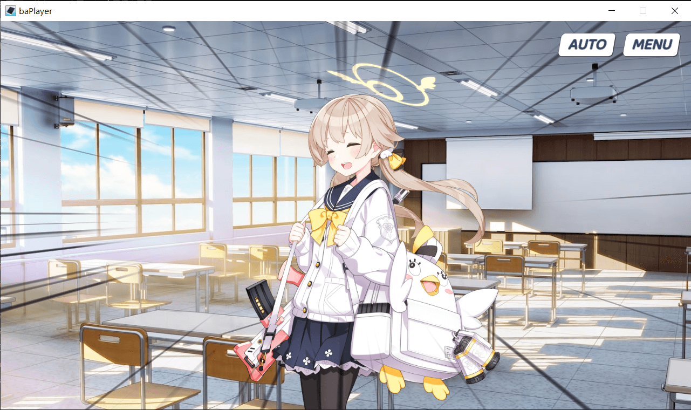
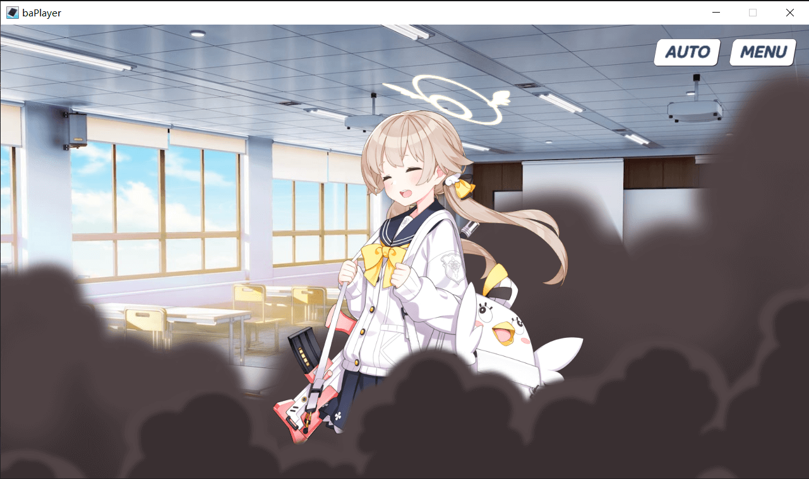

# 幕布

## 逐渐显示

- 命令 `curtain show`

## 逐渐隐藏

- 命令 `curtain hide`

## 直接出现

- 命令 `curtain showD`

## 直接隐藏

- 命令 `curtain hidedD`

## 设置为 黑/白/红 色

- 命令 `curtain black/white/red`

# 场景效果

- 场景效果为发现一个加一个，如有添加提议请开一个 [Issues](https://github.com/Tualin14/baPlayer/issues)
- 如果只为了录制发视频的话，也可以播放器不使用然后后期配

## 速度线 speedline

- 速度线出现 `speedline show`
- 速度线消失 `speedline hide`
- 可以指定显示秒数 `speedline s {seconds}`

## 烟雾 smoke

- 显示 `smoke show`
- 隐藏 `smoke hide`

## 沙尘 dust

- 显示 `dust show`
- 隐藏 `dust hide`

## 下雨 rain

- 显示 `rain show`
- 隐藏 `rain hide`

## 下雪 snow

- 显示 `snow show`
- 隐藏 `snow hide`
