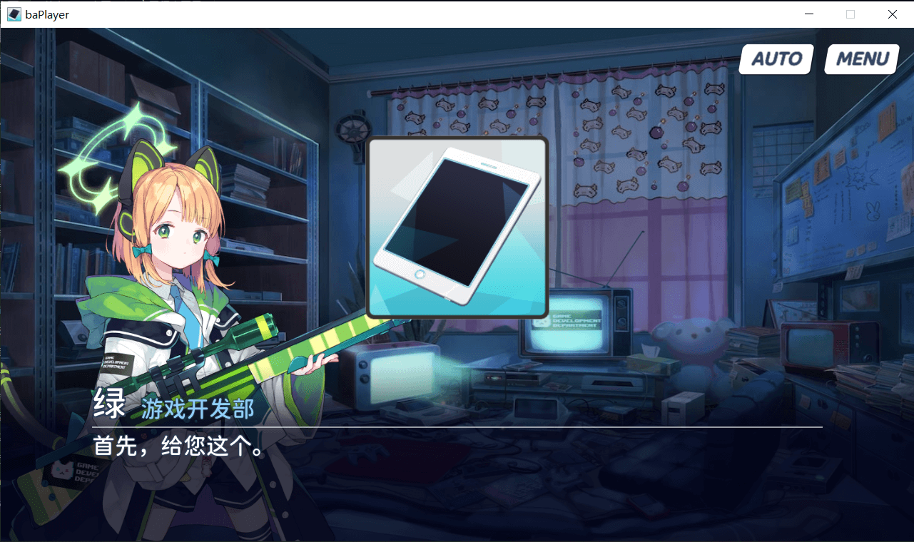

# 背景图片

## 设置背景图片

- 命令 `bg set {nameId} {scale}`
- scale 缩放 float 省略为 1
- 例子 `bg set ClassRoom2` or `bg set ClassRoom2 1`

## 逐渐显示背景

- 命令 `bg show`

## 逐渐隐藏背景

- 命令 `bg hide`

## 直接出现背景

- 命令 `bg showD`

## 直接隐藏背景

- 命令 `bg hideD`

## X/Y 轴抖动

- 命令：`bg shakeX/shakeY {抖动速度} {抖动幅度} {抖动周期}`
- 例 `bg shakeY 10 -40 1`

---

# 覆盖图片

## 设置覆盖图片

- 命令：`cover set {nameId}`
- 例子：`cover set player`

## 显示覆盖图片

- 命令：`cover show`

## 隐藏覆盖图片

- 命令：`cover hide`
