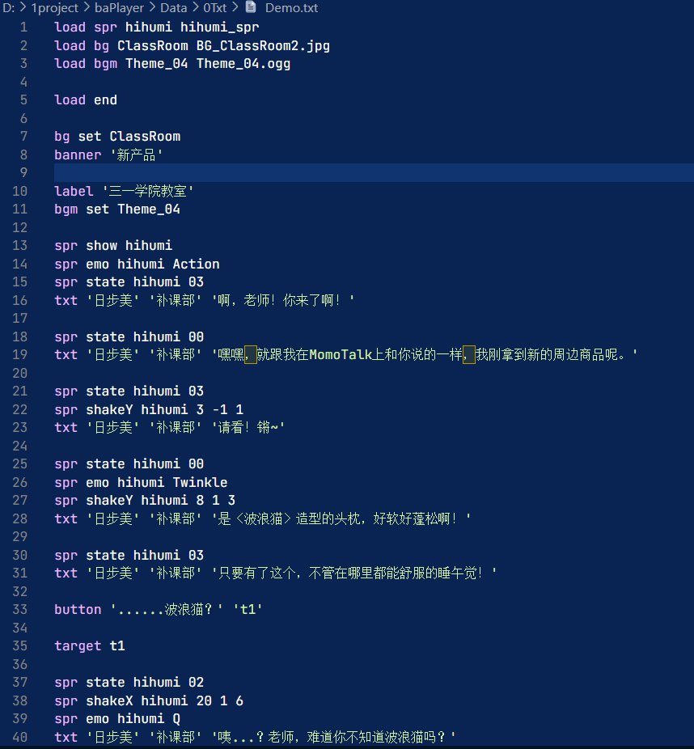

# 使用方法

1. 在 `/Data/0Txt` 文件夹中创建文本文件编写脚本
2. 脚本命令请依次查看目录
3. 打开播放器 `baplayer.exe` 点开 `Menu` 按钮，在 `Txt` 里输入播放脚本文件名字，点击 `Load` 加载完毕后关闭菜单播放
4. 默认加载 `Demo` 文件

## 快捷键

- Space 点击
- 1，2，3 上至下选择按钮
- Enter debug 确定命令

# Data 素材文件结构

- Data
  - 0Txt 存放本地脚本
  - Bgm 本地音乐
  - Image 本地图片
    - Background 背景图片
    - Cover 覆盖图片
  - SE 本地音效
  - Spr 本地人物

# 表情预览方法见目录 9

# 脚本辅助 vscode 插件

- 在 vscode 里搜 [baplayer command](https://marketplace.visualstudio.com/items?itemName=dzaaaaaa.baplayer-command)
- 效果

