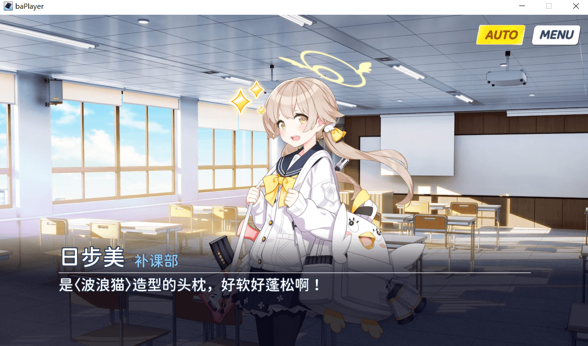

# Aris Studio 爱丽丝工坊

做你自己的碧蓝档案故事 | Make your own BlueArchive story

图标由 [無花果洋\_wzy](https://b23.tv/RbW7CyF) 制作

# 下载 Download

> [下载 ArisStudio](https://github.com/Tualin14/ArisStudio/releases)

> [下载 素材 Data](https://oss.dza.vin/share@dzaaaaaa.com/baPlayer%E5%8F%AF%E7%94%A8%E7%B4%A0%E6%9D%90%E9%9B%86)

- 解压到 Data 中[相应文件夹](https://github.com/Tualin14/ArisStudio/wiki#%E6%96%87%E4%BB%B6%E7%9B%AE%E5%BD%95%E7%BB%93%E6%9E%84)
- 素材收集于网络，如有缺少请自行添加
- [tool](https://bafybeifnsfrvr2iiy4kdttni2ek7lnwj7yt2wyk4rkyimmyc2qyex3draa.ipfs.w3s.link/)

# [如何使用 How to Use(New Doc)](https://github.com/Tualin14/ArisStudio/wiki)

# [旧版文档 1.3.4 Old Doc](https://github.com/Tualin14/ArisStudio/tree/1.3.4.BackUp/Doc)

# 来看看一些使用播放器完成的作品吧ヾ(≧▽≦\*)o

- [老师，一起来过年吧！](https://b23.tv/9UdXBxk)
- [游戏开发部要做 H-game？！](https://b23.tv/QaqP4Ew)
- [诺亚与优香与老师 1](https://b23.tv/rkZMNXg)
- [“最伟大的游戏”](https://b23.tv/z18G8Fs)
- [才羽绿的新年礼物 Part.1](https://b23.tv/V9oeqd5)

# [Issues](https://github.com/Tualin14/ArisStudio/issues)

- 在 [Issues](https://github.com/Tualin14/ArisStudio/issues) 提交反馈和意见
- 加入新效果，表情等内容请 **提供游戏内出现位置**
- 无法播放等问题请尽量提供 **相关文本**

# 贡献

- unity 版本 2019.3.15f1
- 需要: 更好的 UI，更好的还原动画

# Credits

- [spine-unity](http://zh.esotericsoftware.com/spine-unity)
- [UnitySkipSplash](https://github.com/psygames/UnitySkipSplash)
- [Unity3dRichTextHelper](https://github.com/majecty/Unity3dRichTextHelper)

# Licence

GPL-3.0 © [Tualin14](https://github.com/Tualin14/ArisStudio)
