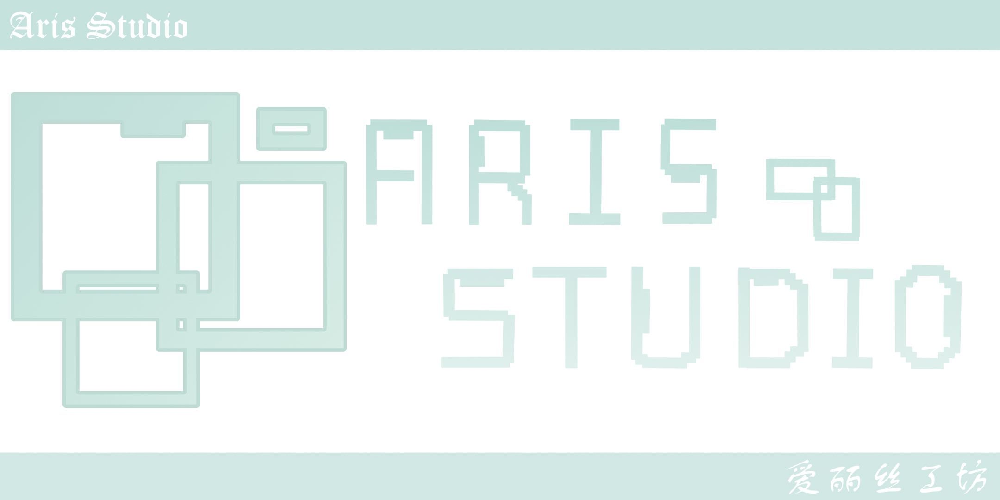
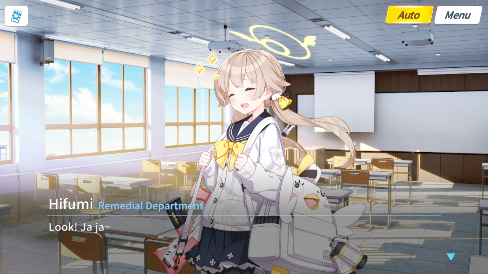

# Aris Studio

## News

- [6 March 2023] Aris Studio [English (EN) Documentation](https://github.com/kiraio-moe/ArisStudio/wiki "English (EN) Documentation") is now available.
- [5 March 2023] Aris Studio [Discussion panel](https://github.com/kiraio-moe/ArisStudio/discussions "Discussion") is now opened.  
    Please post a feedback or talk about the development of Aris Studio with other fellow Sensei here.

## Overview

    
    Logo made by <a href="https://b23.tv/RbW7CyF" title="無花果洋\_wzy">無花果洋\_wzy</a>
    
<b>Make your own Blue Archive story</b>

    

    Aris Studio is a fan-made tool to create <a href="https://bluearchive.nexon.com/home" title="Blue Archive">Blue Archive</a> story.
     
    It's provide a story teller similar to Blue Archive game, but with more features.

## Downloads

 

- [Aris Studio](https://github.com/Tualin14/ArisStudio/releases "Download Aris Studio")
- [Materials Data](https://oss.dza.vin/share@dzaaaaaa.com/baPlayer%E5%8F%AF%E7%94%A8%E7%B4%A0%E6%9D%90%E9%9B%86 "Download Materials Data")

## How to Use

- [Read New Documentation](https://github.com/kiraio-moe/ArisStudio/wiki "Read New Documentation")
- [Read Legacy Documentation (v1.3.4 Documentation)](https://github.com/Tualin14/ArisStudio/tree/1.3.4.BackUp/Doc "Read Legacy Documentation (v1.3.4 Documentation)")

## Awesome works done with Aris Studio ヾ(≧▽≦\\\*)o

- [Sensei, let's celebrate the New Year together!](https://b23.tv/9UdXBxk "Watch Sensei, let's celebrate the New Year together! on bilibili")
- [The Game Development Department wants to do H-game?!](https://b23.tv/QaqP4Ew "Watch The Game Development Department wants to do H-game?! on bilibili")
- [Noah and Yuka and Sensei 1](https://b23.tv/rkZMNXg "Watch Noah and Yuka and Sensei 1 on bilibili")
- [“Greatest Game Ever”](https://b23.tv/z18G8Fs "Watch “Greatest Game Ever” on bilibili")
- [Saiba Green's New Year's Gift Part. 1](https://b23.tv/V9oeqd5 "Watch Saiba Green's New Year's Gift Part. 1 on bilibili")

## Contribute

- Making a [Pull Request](https://github.com/Tualin14/ArisStudio/pulls).
- Add new/missing materials data.
- Submit Ideas, Feedbacks or Comments on [Issues](https://github.com/Tualin14/ArisStudio/issues "Issues") or [Aris Studio Discussions](https://github.com/kiraio-moe/ArisStudio/discussions/categories/ideas-feedbacks-suggestions).

## Todo's

- Add new effects, emoticons and other contents.
- Better UI/UX and animation.

## Credits

- [spine-unity](https://en.esotericsoftware.com/ "Visit spine-unity website")
- [UnitySkipSplash](https://github.com/psygames/UnitySkipSplash "Visit UnitySkipSplash GitHub repo")
- [Unity3dRichTextHelper](https://github.com/majecty/Unity3dRichTextHelper "Visit Unity3dRichTextHelper GitHub repo")
- [remove-unity-splash-screen](https://github.com/kiraio-moe/remove-unity-splash-screen "Visit remove-unity-splash-screen GitHub repo")
- [UnitySimpleFileBrowser](https://github.com/yasirkula/UnitySimpleFileBrowser "Visit UnitySimpleFileBrowser GitHub repo")
- [Save-System-For-Unity](https://github.com/IntoTheDev/Save-System-for-Unity "Visit Save-System-for-Unity GitHub repo")
- [DoTween](https://github.com/Demigiant/dotween "Visit DoTween GitHub repo")
- [scene-loader](https://github.com/Home-Alone-Studios/scene-loader "Visit scene-loader GitHub repo")
- [UnityRecyclingListView](https://github.com/sinbad/UnityRecyclingListView "Visit UnityRecyclingListView GitHub repo")
- [TMP_Typewriter](https://github.com/baba-s/TMP_Typewriter "Visit TMP_Typewriter GitHub repo")
- [SoftMaskForUGUI](https://github.com/mob-sakai/SoftMaskForUGUI "Visit SoftMaskForUGUI GitHub repo")
- [Unity_TabsUI](https://github.com/herbou/Unity_TabsUI "Visit Unity_TabsUI GitHub repo")

## License

This project is licensed under [GNU General Public License v3.0](./LICENSE "See LICENSE file").

## Disclaimer

This project is not affiliated with Nexon, NEXON Games Co., Ltd. nor any their affiliator.

This project is intended only as a tool for fun. Any game assets and resources related to Blue Archive used in this project is property and copyright of those respective authors.

Made with ❤️ by <a href="https://github.com/Tualin14/" title="Visit Tualin14 GitHub profile">Tualin14</a> & <a href="https://github.com/Tualin14/ArisStudio/graphs/contributors" title="See Contributors list">Contributors</a>

