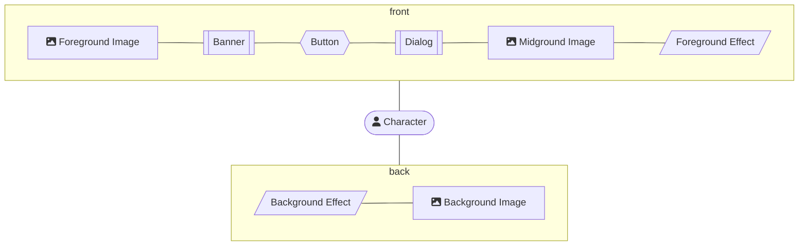

# 贡献新内容

1. fork 本仓库
2. 创建一个本地克隆副本
3. 自行下载 [spine-unity 3.8 for Unity 2017.1-2020.3](http://esotericsoftware.com/spine-unity-download/#spine-unity-unitypackages)，并将 `Spine` 添加到项目中。

```mermaid
flowchart TD
fg[fa:fa-image Foreground Image]
md[fa:fa-image Midground Image]
bg[fa:fa-image Background Image]

char([fa:fa-user Character])

fe[/Foreground Effect/]
be[/Background Effect/]

btn{{Button}}
dialog[[Dialog]]
banner[[Banner]]

subgraph front
fg --- banner --- btn --- dialog --- md --- fe
end

front --- char --- back

subgraph back
be --- bg
end
```
